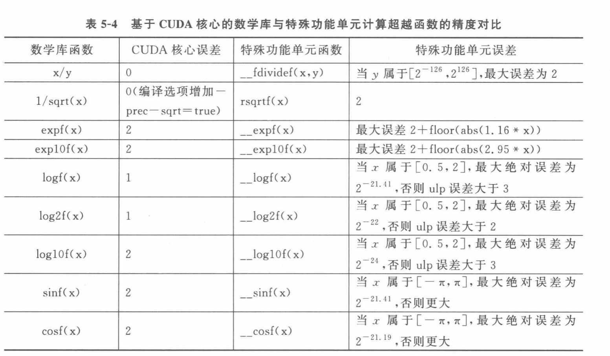

- reference

  
- e^x^ 的输入范围在 [-8.9, 0],最大误差为12ulp,绝对误差在10^-6^

| **输入 x (Logits)**                 | **ULP 误差倍数计算**                                  | **最大误差 (ULP)** |
| ----------------------------------------- | ----------------------------------------------------------- | ------------------------ |
| **0.0**(最大值点)                   | **$2 + \lfloor 1.16 \times 0 \rfloor$**             | **2 ULP**          |
| **$-1.76$**(**$q=0.90$**) | **$2 + \lfloor 1.16 \times 1.76 \rfloor = 2 + 2$**  | **4 ULP**          |
| **$-3.11$**(**$q=0.50$**) | **$2 + \lfloor 1.16 \times 3.11 \rfloor = 2 + 3$**  | **5 ULP**          |
| **$-8.90$**(最小值)               | **$2 + \lfloor 1.16 \times 8.90 \rfloor = 2 + 10$** | **12 ULP**         |

- $\frac{1}{x}$的输入范围为[1,16384]

| **输入 x**    | **输出 1/x**               | **ULP 物理值 (数量级)** | **绝对误差 (数量级)** |
| ------------------- | -------------------------------- | ----------------------------- | --------------------------- |
| **$1$**     | **$1.0$**                | **$10^{-7}$**         | **$10^{-7}$**       |
| **$16384$** | **$6.1 \times 10^{-5}$** | **$10^{-12}$**        | **$10^{-11}$**      |
